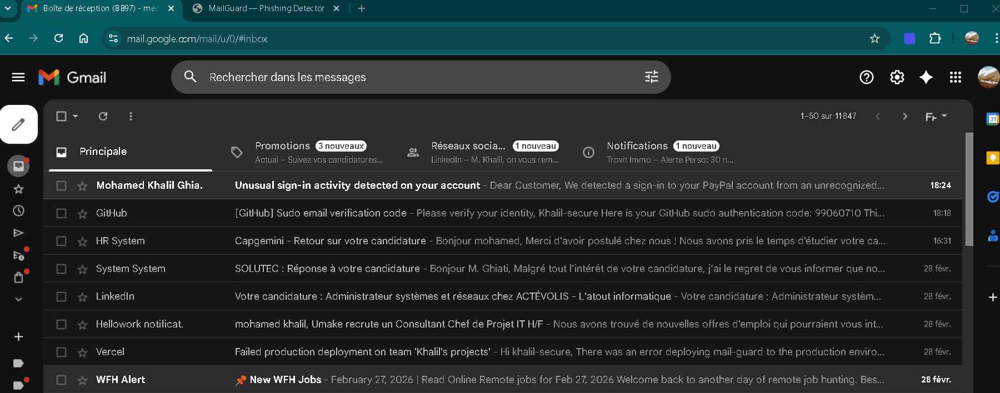
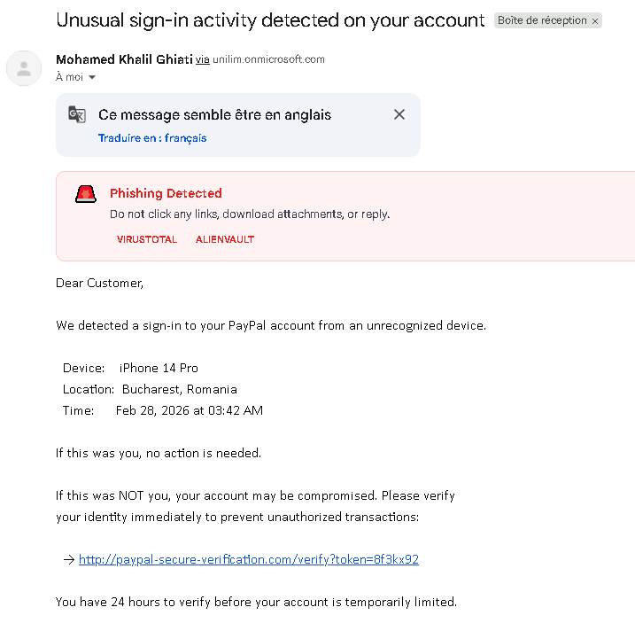
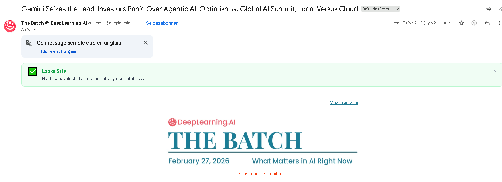
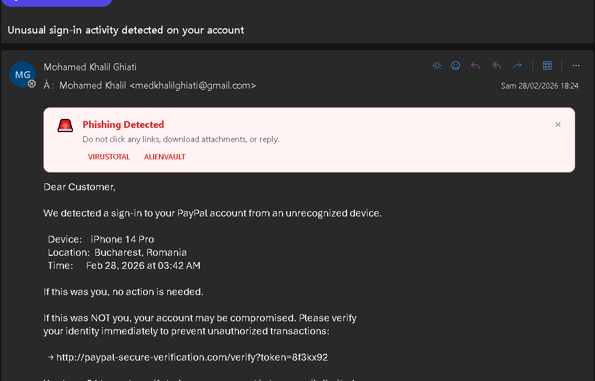
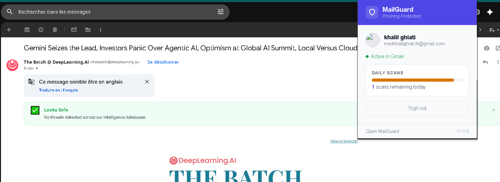
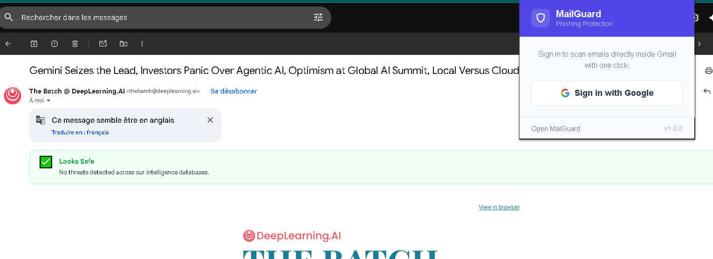

# MailGuard Extension 🛡️

> Real-time phishing detection inside Gmail and Outlook — powered by 5 threat intelligence engines.

**Part of the [MailGuard](https://mail-guard-beta.vercel.app) platform.**

---

## What it does

MailGuard Extension adds a one-click phishing scanner directly inside your email client. No copy-pasting, no switching tabs — scan any email the moment you open it.




---

## Features

- **Works inside Gmail and Outlook** — injects seamlessly into the email reading pane
- **One-click scan** — purple "Scan with MailGuard" button appears on every email
- **Instant verdict** — SAFE ✅, SUSPICIOUS ⚠️, or PHISHING 🚨
- **Full breakdown** — shows which engines flagged the email and why
- **Persistent login** — sign in once with Google, stay logged in
- **Daily scan counter** — shows remaining free scans in the popup
- **Powered by 5 engines** — VirusTotal, AlienVault OTX, Google Safe Browsing, AbuseIPDB, Typosquatting detection

---

## Screenshots

### Gmail — Phishing detected


### Gmail — Safe email


### Outlook — phishing email


### Extension popup — Logged in


### Extension popup — Logged out


---

## How it works

```
User opens email in Gmail or Outlook
        ↓
MailGuard button appears at the top of the email
        ↓
User clicks "Scan with MailGuard"
        ↓
Extension sends sender + subject + body to MailGuard API
        ↓
API checks against 5 threat intelligence databases in parallel
        ↓
Verdict injected directly into the email:
  🚨 PHISHING — Do not click any links
  ⚠️  SUSPICIOUS — Proceed with caution
  ✅ SAFE — No threats detected
```

---

## Tech Stack

| Layer | Technology |
|---|---|
| Extension | Chrome Manifest V3 |
| Content scripts | Vanilla JS — injected into Gmail + Outlook DOM |
| Auth bridge | Syncs JWT from web app to extension storage |
| Storage | `chrome.storage.local` |
| Auth | Google OAuth 2.0 + JWT (via MailGuard API) |
| Backend | MailGuard API — Node.js gateway + Python FastAPI |
| Threat engines | VirusTotal, AlienVault OTX, Google Safe Browsing, AbuseIPDB, Typosquatting |

---

## Architecture

```
Gmail / Outlook (browser)
        │
        ▼
content script (gmail.js / outlook.js)
        │  reads JWT from chrome.storage
        ▼
MailGuard API (Node.js gateway)
        │  verifies JWT + checks rate limit
        ▼
Phishing Detector (FastAPI)
        │  parallel async checks
        ├── VirusTotal
        ├── AlienVault OTX
        ├── Google Safe Browsing
        ├── AbuseIPDB
        └── Typosquatting engine
        │
        ▼
Verdict injected into email DOM
```

---

## Use Cases

### 1. HR & Recruitment teams
Recruiters receive hundreds of emails daily — many from unknown senders with links. MailGuard flags credential harvesting and fake job board phishing attempts before anyone clicks.

### 2. Finance & Accounting
Invoice fraud and CEO impersonation attacks target finance teams. MailGuard catches typosquatting attacks like `finance@c0mpany.com` before wire transfers are made.

### 3. SMBs without IT security
Small businesses can't afford enterprise email security tools like Proofpoint or Mimecast. MailGuard brings the same threat intelligence to any inbox for free.

### 4. Remote workers
Phishing attacks targeting remote employees via personal email accounts bypass corporate security filters. MailGuard works on any Gmail or Outlook account.

### 5. Schools and universities
Students are high-value targets for credential theft. MailGuard provides institutional-grade protection at zero cost.

---

## Authentication Flow

```
User visits mail-guard-beta.vercel.app
        ↓
Signs in with Google OAuth
        ↓
JWT token saved to localStorage
        ↓
auth_bridge.js (content script) copies token to chrome.storage
        ↓
Extension reads token for all API calls
        ↓
Token refreshes automatically — stay logged in for 7 days
```

---

## Rate Limiting

| Plan | Scans/day | Price |
|---|---|---|
| Free | 10 | Free |
| Pro | Unlimited | Coming soon |

---

## Privacy

- Email content is sent to the MailGuard API for analysis only
- No email content is stored or logged
- Only scan metadata (timestamp, user ID) is recorded for rate limiting
- Google OAuth is used for authentication only — no Gmail API access requested

---

## Roadmap

- [ ] Firefox support
- [ ] Auto-scan mode — scan emails automatically without clicking
- [ ] Notification badges — red/green icon on flagged emails in inbox list
- [ ] Pro plan — unlimited scans via Stripe
- [ ] Enterprise plan — team accounts, admin dashboard, audit logs
- [ ] Safari extension (macOS)

---

## Status

🔒 Private repository — commercial release pending Stripe integration.

For access or partnership inquiries: medkhalilghiati@gmail.com

---

*Built by a junior dev who refused to give up.*
